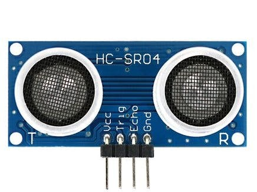

# IOT-Water-Management
An IOT based Water Level Management system.

For this project, you will need the following pieces of hardware:

1. Nodemcu ESP8266 

2. Ultrasonic sensor

3. Relay Module

4. Jumper Wires

5. Breadboard

Steps to connect the wires:
1. Connect the VCC pin of the water level sensor with the Vin pin of the NodeMCU.
2. Attach the GND pin of the water level sensor with the GND pin of the NodeMCU.
3. Join the signal pin of the water level sensor with the analog-0 pin of the NodeMCU.
4. Connect the GND pin of the module with the GND pin of the NodeMCU.
5. Join the R pin of the module with the digital-7 pin of the NodeMCU.
6. Attach the G pin of the module with the digital-6 pin of the NodeMCU.
7. Connect the B pin of the module with the digital-5 pin of the NodeMCU.

To execute this project, download the Blynk app. Upload main.cpp to your NodeMCU and then run the program.
